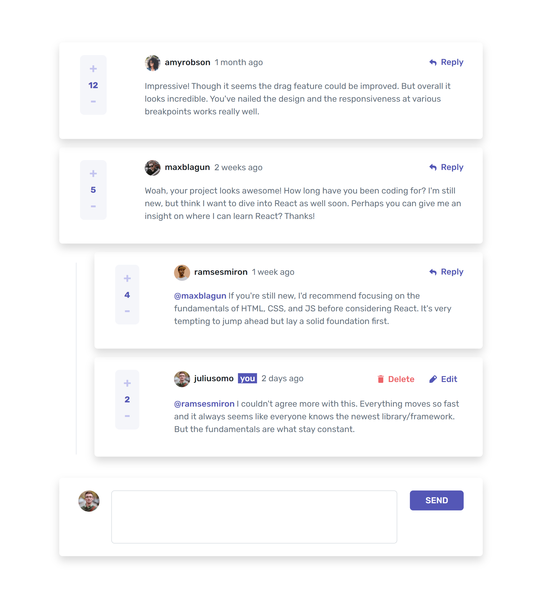

# Frontend Mentor - Interactive comments section solution

This is a solution to the [Interactive comments section challenge on Frontend Mentor](https://www.frontendmentor.io/challenges/interactive-comments-section-iG1RugEG9). Frontend Mentor challenges help you improve your coding skills by building realistic projects. 

## Table of contents

- [Overview](#overview)
  - [The challenge](#the-challenge)
  - [Screenshot](#screenshot)
  - [Links](#links)
- [My process](#my-process)
  - [Built with](#built-with)
  - [What I learned](#what-i-learned)
  - [Continued development](#continued-development)
  - [Useful resources](#useful-resources)
- [Author](#author)

**Note: Delete this note and update the table of contents based on what sections you keep.**

## Overview

### The challenge

Users should be able to:

- View the optimal layout for the app depending on their device's screen size
- See hover states for all interactive elements on the page
- Create, Read, Update, and Delete comments and replies
- Upvote and downvote comments
- **Bonus**: If you're building a purely front-end project, use `localStorage` to save the current state in the browser that persists when the browser is refreshed.
- **Bonus**: Instead of using the `createdAt` strings from the `data.json` file, try using timestamps and dynamically track the time since the comment or reply was posted.

### Screenshot



### Links

<!-- - Solution URL: [Add solution URL here](https://your-solution-url.com) -->
- Live Site URL: [Add live site URL here](https://your-live-site-url.com)

## My process

### Built with

- Semantic HTML5 markup, CSS custom properties, Bootstrap
- [React](https://reactjs.org/) - JS library
- [Typescript](https://www.typescriptlang.org/)
- [React Hook Form](https://react-hook-form.com/) - For form

**Note: These are just examples. Delete this note and replace the list above with your own choices**

### What I learned

For this project I've implement useContext hook and react context to refractor alot of my code. I also able to play around the localstorage within react, and this allow me to build a purely frontend app. With the power of typescript, I able to specify type and avoid many bugs that can easily happen with normal JS.

```js
/* assign context */
type ModalHandler = {...}
type CommentHandler = {...}

type Context = {
    modalHandler?: ModalHandler;
    commentHandler?: CommentHandler;
}

const AppContext = createContext<Context>({});

/*use context in a deeply nested child component*/
const { commentHandler } = useContext(AppContext);
if (!commentHandler) return null;
const { handleSelectedEditComment, onEdit } = commentHandler;

```

### Continued development

I love to spend more time on making the app become a MERN fullstack app.

### Useful resources

- [React use form](https://react-hook-form.com/) - This helped me for form handling. I really liked its hook and data modeling pattern and will use it going forward.

## Author

- Website - [Hongleang Lim](https://web-dev-portfolio1066.netlify.app/)
- Frontend Mentor - [@hongleang](https://www.frontendmentor.io/profile/hongleang)
